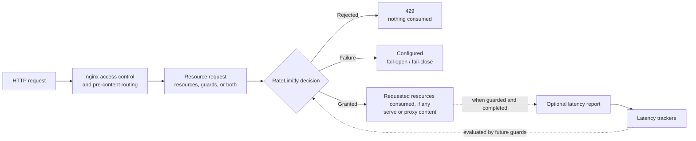

# rl-nginx

## What RateLimitly and rl-nginx do

[RateLimitly](https://ratelimitly.com/) is a distributed admission-control
service. It decides whether an application may begin work that consumes
configured resources. The decision may also depend on whether recently
observed service latencies remain below application-defined thresholds.

`rl-nginx` is the nginx HTTP integration for that decision. After nginx access
control and pre-content routing have succeeded, the module turns configured
nginx values into one RateLimitly resource request containing resource
consumptions, latency guards, or both. A valid grant consumes every requested
resource, if any, and nginx proceeds directly to content processing. A
rejection consumes nothing and returns `429 Too Many Requests`.

The module uses the public
[`rl-c-client`](https://github.com/ratelimitly-com/rl-c-client) for credentials,
DNS membership, packet encoding, request delivery, response selection, and
canonical state identifiers. This repository documents what the nginx module
adds: directives, nginx phase ordering, failure policy, request lifetime,
latency measurement, and operations.

## The operation model

RateLimitly exposes two independent logical operations:

- A **resource request** describes work nginx wants to admit as zero or more
  resource consumptions and zero or more latency guards. `rl-nginx` requires
  at least one of the two. RateLimitly evaluates the complete request
  atomically. A grant consumes every requested quantity; a rejection consumes
  none.
- A **latency report** contributes measured service latency to a tracker that
  future latency guards can evaluate. It neither requests nor consumes a
  resource and does not make an admission decision.

A protected HTTP request that reaches the module's final admission point
attempts the first operation. When that request has a latency guard and
receives a valid grant, the module also measures the admitted work and performs
the second operation if the request reaches nginx log phase without a client
abort. The report is still an independent RateLimitly operation: a denial or
dependency failure does not produce one.



The version-matched C-client documentation is authoritative for the
[operation model](https://github.com/ratelimitly-com/rl-c-client/blob/v0.6.0/docs/api.md#operation-model)
and the distinction between
[resource requests and latency reports](https://github.com/ratelimitly-com/rl-c-client/blob/v0.6.0/README.md#core-operations).

## Three small nginx examples

These snippets assume that the tenant, API key, resolver, and upstream are
configured as shown in [Minimal Configuration](#minimal-configuration).

### Consume one resource

In English: “Before serving `/checkout/`, get me one token from the `checkout`
bucket, whose limit is 100 tokens per second.”

```nginx
ratelimitly_zone checkout "bucket=checkout" rate=100r/s;

location /checkout/ {
  ratelimitly zone=checkout;
  proxy_pass http://127.0.0.1:9000;
}
```

A grant consumes one token and authorizes nginx to proxy the request. A
rejection consumes nothing and nginx returns `429`.

### Consume two resources atomically

In English: “Get me one global checkout token and one token for this client
address; proceed only if both are available.”

```nginx
ratelimitly_zone checkout_global "bucket=checkout|scope=global" rate=100r/s;
ratelimitly_zone checkout_client
  "bucket=checkout|scope=client|ip=$remote_addr"
  rate=5r/s;
ratelimitly_group checkout_limits zone=checkout_global zone=checkout_client;

location /checkout/ {
  ratelimitly group=checkout_limits;
  proxy_pass http://127.0.0.1:9000;
}
```

RateLimitly evaluates the group as one request. A grant consumes one token from
both buckets; if either limit rejects the request, neither consumption occurs.
Before using an address as identity, configure nginx real-IP or proxy-protocol
trust correctly.

### Add one latency guard

In English: “Get me one checkout token, but only while the tracked `inventory`
latency is below 100 ms. After admitted work completes, report the latency
measured by nginx.”

```nginx
ratelimitly_zone checkout "bucket=checkout" rate=100r/s;

ratelimitly_guard inventory_latency
  "service=inventory"
  threshold=100ms;

location /checkout/ {
  ratelimitly zone=checkout guard=inventory_latency;
  proxy_pass http://127.0.0.1:9000;
}
```

The resource consumption and guard are one atomic admission request. After a
valid grant, `rl-nginx` measures from nginx request start to log phase and sends
the resulting service latency independently. The module sends no report for a
rejection, dependency failure, or aborted client.

A guard can also be the complete admission policy when the operation does not
consume a rate-limited resource:

```nginx
location /inventory-health/ {
  ratelimitly guard=inventory_latency;
  proxy_pass http://127.0.0.1:9000;
}
```

This sends a Rate Request with no resource consumptions and one latency guard.
A passing guard admits the HTTP request; a failing guard returns `429`. After
a valid grant and completed admitted work, nginx reports the measured latency
under the same eligibility rules as a mixed resource-and-guard request.

## Allow, deny, and failure are different outcomes

Every protected request must distinguish three outcomes:

| Outcome | Meaning | nginx behavior |
| --- | --- | --- |
| Grant | RateLimitly approved the complete request and consumed every requested resource. | Continue to content processing. |
| Rejection | RateLimitly rejected at least one condition and consumed nothing. | Return `429 Too Many Requests`. |
| Failure | No usable RateLimitly decision was obtained. It is neither a grant nor a rejection. | Apply `ratelimitly_fail open\|close`. |

A failure after transmission does not prove that no server processed the
request. Choose the failure policy as an explicit availability-versus-control
decision; see [Request and failure policy](docs/configuration.md#request-and-failure-policy).

The planned `0.1.x` public preview is source-only. It supports static and
dynamic module builds on Linux with glibc and nginx `1.30.2` or `1.31.1`; the
exact release scope is in [the compatibility guide](docs/compatibility.md).

## Quick Start

The commands below use the repository's pinned nginx `1.31.1` submodule and
automatically fetch the locked public `rl-c-client` `v0.6.0` release. No private
repository, RateLimitly server, tenant, or API key is needed to build and run
the public test suite.

On Debian or Ubuntu, install the required tools and build dependencies:

```sh
sudo apt-get update
sudo apt-get install -y \
  build-essential curl dnsutils git libpcre2-dev libssl-dev procps python3 \
  zlib1g-dev
```

Clone the repository with its pinned nginx source and run the required static
contributor gate:

```sh
git clone --recurse-submodules https://github.com/ratelimitly-com/rl-nginx.git
cd rl-nginx
make check
```

`make check` verifies scripts and dependency locks, builds the static module,
checks nginx configuration, runs the deterministic public integration suite,
and checks whitespace. The integration suite reuses the exact static binary
built from `BUILD_FLAGS`; dynamic flags are rejected because that mode does not
produce the nginx binary this target exercises. It materializes the C client at
`./_deps/rl-c-client`; that checkout must match the tag and full commit in
[`dependencies/rl-c-client.env`](dependencies/rl-c-client.env) and have a clean
working tree.

The resulting static nginx binary is:

```text
upstream-nginx/objs/nginx
```

For a dynamic module instead, run:

```sh
make build BUILD_FLAGS="--dynamic --compat --clean"
make dynamic-relocation-test
```

The dynamic artifact is:

```text
upstream-nginx/objs/ngx_http_rn_module.so
```

Build a deployment artifact against the same nginx release and compatible
configure options as the nginx binary that will run it. See
[Building rl-nginx](docs/build.md) before installing either artifact.

## Minimal Configuration

The tenant domain and API key below are deliberately non-working placeholders.
Replace both before running `nginx -t`. Also replace the resolver address if
`127.0.0.53` is not the DNS resolver available to your nginx workers. The
resolver must be declared directly in the `http` context: the module has one
worker-local client, so server/location resolver overrides do not select its
discovery resolver.

```nginx
events {}

http {
  resolver 127.0.0.53 valid=30s ipv6=off;

  ratelimitly_dns_srv  tenant.example.invalid;
  ratelimitly_auth_key rl-aes1REPLACE_WITH_YOUR_KEY;
  ratelimitly_policy   standard unit=50ms;
  ratelimitly_fail     close;

  ratelimitly_zone api
    "bucket=v1|scope=api|ip=$remote_addr"
    rate=100r/s;

  server {
    listen 8080;

    location /api/ {
      ratelimitly_label "scope=api";
      ratelimitly zone=api;
      proxy_pass http://127.0.0.1:9000;
    }
  }
}
```

For a dynamic build, load the installed module before the `events` block:

```nginx
load_module modules/ngx_http_rn_module.so;
```

RateLimitly discovery queries
`_ratelimitly._udp.<your-tenant-domain>`. The control plane must provide the
tenant, API key, and corresponding DNS SRV record; this repository does not
create or run those services. Start from
[`examples/minimal.conf`](examples/minimal.conf), review
[`examples/security-conscious.conf`](examples/security-conscious.conf), and
read the [configuration guide](docs/configuration.md) before deploying. Treat
`ratelimitly_auth_key` as a secret.

## nginx Integration Contract

`rl-nginx` owns the HTTP-specific part of the workflow:

- `ratelimitly_zone` defines one nginx-native resource consumption and
  `ratelimitly_group` combines several consumptions into one atomic request.
- `ratelimitly_guard` attaches latency conditions and identifies which
  admitted work nginx will measure and report.
- The module runs after nginx access control and earlier pre-content routing.
  It sends no RateLimitly request for traffic rejected before that point.
- A valid grant is the final admission decision and advances directly to
  content. Later upstream or content failure does not reverse consumption.
- An internal redirect reuses the main request's admission; subrequests do not
  create independent RateLimitly admissions.
- `$ratelimitly_verdict` records only valid `allow` or `deny` provenance.
  Runtime failures apply `ratelimitly_fail` and leave the variable unset.

`rl-c-client` owns the client mechanics beneath this contract. Its
[Resource-Request HA Policy](https://github.com/ratelimitly-com/rl-c-client/blob/v0.6.0/docs/api.md#resource-request-ha-policy)
defines fan-out, oldest-server preference, replay, completion delivery, and
deduplication TTL. Its
[DNS Refresh](https://github.com/ratelimitly-com/rl-c-client/blob/v0.6.0/docs/api.md#dns-refresh)
and
[Error Codes](https://github.com/ratelimitly-com/rl-c-client/blob/v0.6.0/docs/api.md#error-codes)
sections define the client behavior that the module adapts to nginx.

This module does not create tenants, issue credentials, manage RateLimitly DNS,
or include a RateLimitly server.

## Core Directives

- `ratelimitly_dns_srv [tenant-domain];` (optional; defaults to `c-${api-key-id}.p0.ratelimitly.com`)
- `ratelimitly_dns_resolver <ip> ...;` (optional; alias `ratelimitly_resolver`, defaults to system DNS `/etc/resolv.conf`)
- `ratelimitly_auth_key <rl-cookie...|rl-aes...>;`
- `ratelimitly_policy standard|single_round|custom ...;`
- `ratelimitly_fail open|close;` — **defaults to `open`.** When no usable
  decision is available the request continues normal nginx processing, i.e.
  enforcement is bypassed. Set this explicitly in every production
  configuration.
- `ratelimitly_bind <ip>;`
- `ratelimitly_debug on|off;`
- `ratelimitly_zone <name> "bucket=<template>" rate=<rate>;`
- `ratelimitly_group <name> zone=<zone> ...;`
- `ratelimitly_guard <name> "service=<template>" threshold=<duration> ...;`
- `ratelimitly zone=<name> [guard=<name>] ...;`,
  `ratelimitly group=<name> [guard=<name>] ...;`, or
  `ratelimitly guard=<name> [guard=<name>] ...;`
- `ratelimitly_label "<template>";`

Rendered bucket and service keys are limited to 1024 bytes; labels are limited
to 256 bytes. Quote a complete named argument (`"bucket=value"` or
`"service=value"`), not only its value. Empty/oversized dynamic identifiers
follow `ratelimitly_fail`, while invalid static values fail `nginx -t`.

See the [configuration guide](docs/configuration.md) for directive behavior and
the [DSL reference](spec/dsl.md) for complete syntax.

`$ratelimitly_verdict` is `allow` or `deny` only for a valid RateLimitly
decision. It is not found (normally logged as `-`) for fail-open, fail-close,
bypassed, unfinished, internal-error, and aborted requests. It reports
decision provenance, not the final upstream/content status.

## Supported Dependency Policy

Supported builds use immutable inputs:

| Dependency | Supported revision |
| --- | --- |
| nginx stable | `release-1.30.2` at `a92a537860c7b87d3793d9eb41c9cf3ed833b53c` |
| nginx mainline and default submodule | `release-1.31.1` at `d44205284fa41662da803b796d6056fc1e59b1f3` |
| `rl-c-client` | `v0.6.0` at `a9cfc87e7eb90a99d77028b18d1079b301cf619c` |

Set `NGINX_SRC=/path/to/nginx-src` when testing another supported nginx source
tree. Set `RCLIENT_DIR=/path/to/rl-c-client` only when intentionally developing
or packaging against another client checkout. An override is not a supported
release lock, may contain local changes, and no sibling checkout is selected
implicitly. The selected client must also pass the
[callback and ownership contract](docs/c-client.md#required-lifecycle-contract).

Scheduled compatibility probes test `rl-c-client/main` and nginx `master` for
early warning only. Required builds and support claims remain on the immutable
revisions above.

## Testing

The required static contributor entrypoint is:

```sh
make check
```

Release readiness is intentionally broader. For both supported nginx releases,
required CI runs the static contributor gate and relocated dynamic behavior on
native `x86_64` and `aarch64`, plus ASan/UBSan/LSan on `x86_64`. The optional
private full-stack test is supplemental evidence, not a public acceptance gate.
See the [compatibility evidence contract](docs/compatibility.md#release-validation-gates)
for the exact boundary.

Useful narrower gates are:

```sh
make syntax
make unit
make build
make config-test
make public-test
make dynamic-relocation-test
make sanitizers
```

The public integration suite uses the locked C-client responder and local DNS
fixture. It covers enforcement boundaries, fail-open/fail-closed outages, DNS
failure and recovery, timeouts, aborted clients, bounded invalid-UDP ingress,
steering rebinds, guards, malformed responses, response cardinality, reload,
worker survival, and clean shutdown. It requires no real tenant or credential.

The unit gate also runs negative oracle fixtures. They deliberately break each
required Make/CI/specification control and require its checker to turn red;
runtime oracle tests likewise reject a wrong fail-close status, a forced nginx
shutdown, and an incomplete public lifecycle manifest.

`tests/smoke-test.sh` and `tests/burst-test.sh` are manual diagnostics, not
release gates. The private full-stack harness is optional and is not required
for public contributors. See [the integration-test guide](integration-tests/README.md)
for those workflows.

## Documentation and Project Links

- [RateLimitly operations in rl-c-client v0.6.0](https://github.com/ratelimitly-com/rl-c-client/blob/v0.6.0/README.md#core-operations)
- [C-client v0.6.0 public API and policy](https://github.com/ratelimitly-com/rl-c-client/blob/v0.6.0/docs/api.md)
- [Documentation index](docs/index.md)
- [Build and installation](docs/build.md)
- [Configuration](docs/configuration.md)
- [Operations and troubleshooting](docs/operations.md)
- [Compatibility and release scope](docs/compatibility.md)
- [C-client integration](docs/c-client.md)
- [Contributing](CONTRIBUTING.md)
- [Security policy](SECURITY.md)
- [Support and bug reports](SUPPORT.md)
- [Code of conduct](CODE_OF_CONDUCT.md)
- [Changelog](CHANGELOG.md)
- [Third-party notices](THIRD_PARTY_NOTICES.md)
- [Release notes and source archives](https://github.com/ratelimitly-com/rl-nginx/releases)

Do not report suspected vulnerabilities in a public issue. Follow
[`SECURITY.md`](SECURITY.md) instead, and remove tenant credentials from every
configuration snippet and log you share.

## Repository Layout

```text
rl-nginx/
  src/                         nginx module source
  examples/                    copyable nginx configurations
  docs/                        build, configuration, and operations guides
  integration-tests/           deterministic public test harness
  spec/                        detailed configuration and behavior references
  tests/                       lower-level tests and manual diagnostics
  tools/build-nginx.sh         supported build helper
  config                       nginx module build descriptor
```

This repository is licensed under the MIT License; see [LICENSE](LICENSE).
